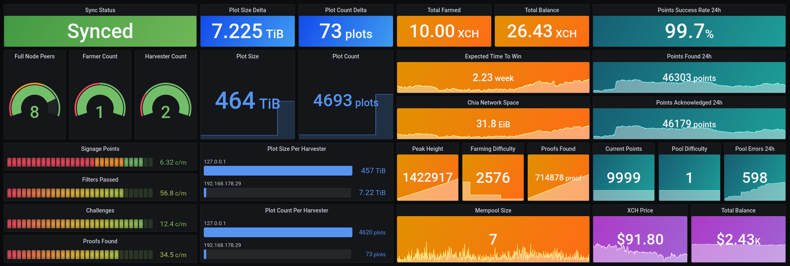
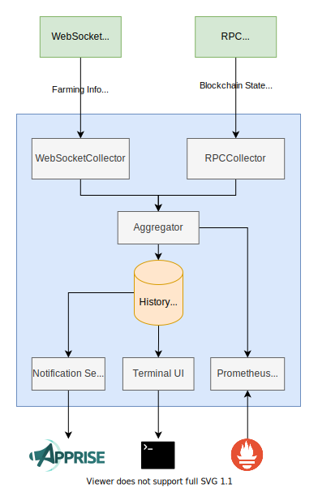

# chia-monitor [](https://discord.gg/K5KyD9mXDh)

A monitoring tool to collect all important metrics from your Chia farming node and connected harvesters. It can send you push notifications with regular status updates and will alert you in case something goes wrong or a proof is found. All metrics are exported to a [Prometheus](https://prometheus.io) compatible `/metrics` endpoint and a [Grafana](https://grafana.com/) dashboard is also provided:



This example dashboard displays almost all collected metrics and can be imported from [grafana.com](https://grafana.com/grafana/dashboards/14544) using the ID `14544` or using the `grafana/dashboard.json` from this repository.

## Notifications
To use notifications, please configure a `status_service_url` and `alert_service_url` for your desired notification service in the `config.json`. You can use most popular notifications services by creating a service specific webhook URL, following the instructions from [this](https://github.com/caronc/apprise/wiki) wiki.

---
Following notifications are currently sent to the `status_service_url`:

### Farm summary (configurable interval in `config.json`)
```
** 👨‍🌾 Farm Status 👩‍🌾 **
🌾 OG Plot Count: 3797
🌾 Portable Plot Count: 50
🧺 OG Plot Size: 375.828 TiB
🧺 Portable Plot Size: 4.948 TiB
🚜 Plot Change 24h: +86 (+8.511 TiB)
⌛️ Signage Points Per Minute: 6.30
🔎 Passed Filters Per Minute: 49.30
✅ Total Proofs found: 73
💰 Total Balance: 2.00001 XCH
🕰️ Time To Win: 2 weeks and 4 days
💾 Current Netspace: 30.706 EiB
🏔️ Peak Height: 544594
📶 Full Node Peer Count: 8
🔄 Synced: True
```
### Proof found alert
```
** 🤑 Proof found! 🤑 **
Your farm found a new partial or full proof
```
---
Following notifications are currently sent to the `alert_service_url`:

### Sync lost alert
```
** 🚨 Farmer Lost Sync! 🚨 **
It seems like your farmer lost its connection to the Chia Network
```
### Sync recovery alert
```
** ✅ Farmer Synced! ✅ **
Your farmer is successfully synced to the Chia Network again
```
### Plots lost alert
Triggers when the total plot count of your farm drops below a configurable threshold (default: 1).

The corresponding `lost_plots_alert_threshold` parameter can be adjusted in the `config.json`.
```
** 🚨 Farmer Lost Plots! 🚨 **
It seems like your farmer lost some plots
Expected: 130, Found: 124
```
### Plots recovery alert
```
** ✅ Farmer Plots recoverd! ✅ **
Your farmer's plot count has recovered to its previous value
```
---
## Metrics
The following statistics are collected from your local [Chia](https://chia.net) node using the [RPC](https://github.com/Chia-Network/chia-blockchain/wiki/RPC-Interfaces) and WebSocket APIs and are then exported via a [Prometheus](https://prometheus.io) compatible `/metrics` HTTP endpoint on port `8000`.

### Supported wallet metrics
- Total balance (`chia_confirmed_total_mojos`)

### Supported full node metrics
- Sync status (`chia_sync_status`)
- Peak height (`chia_peak_height`)
- Difficulty (`chia_diffculty`)
- Total netspace (`chia_network_space`)
- Connection count (`chia_connections_count`)

### Supported harvester metrics
- OG Plot count (`chia_plot_count`)
- OG Plot size (`chia_plot_size`)
- Portable Plot count (`chia_portable_plot_count`)
- Portable Plot size (`chia_portable_plot_size`)

### Supported farmer metrics
- Received signage points (`chia_signage_points`)
- Received signage point index (`chia_signage_point_index`)
- Attempted challenges (`chia_block_challenges`)
- Plots passed filter (`chia_plots_passed_filter`)
- Proofs found (`chia_proofs_found`)

## Prerequisites
To run this tool, we need the following things:
- Python 3
- Pipenv

### Linux (Ubuntu)
```bash
sudo apt install python3 pipenv
```
## Installation
1. Clone the repository
```bash
git clone https://github.com/philippnormann/chia-monitor.git
cd chia-monitor
```
2. Install the required dependencies
```bash
pipenv install 
```
**Windows Only**
```powershell  
pipenv shell
pip install -r requirements.xt  
```
3. Initialize the SQLite database
```bash
pipenv run alembic upgrade head
```
4. Copy the example config file
```bash
cp config-example.json config.json
```
5. Open up `config.json` and configure it to your preferences.

## Updating
1. Pull the latest release from git
```bash
cd chia-monitor
git reset origin/main --hard
git pull
```
2. Update the required dependecies
```bash
pipenv install
```
3. Upgrade the SQLite database model
```bash
pipenv run alembic upgrade head
```
## Usage
To use the tool, run the `monitor` module using `pipenv` from the `chia-monitor` directory
```bash
cd chia-monitor
pipenv run python -m monitor
```
_Note: To run the tool in the background, you can run it as a [service](https://wiki.archlinux.org/title/systemd#Writing_unit_files) or in a detached [screen](https://wiki.archlinux.org/title/GNU_Screen)._

### Basic Prometheus Configuration
Add a block to the `scrape_configs` of your `prometheus.yml` config file:
```yaml
scrape_configs:
  - job_name: chia_monitor
    static_configs:
    - targets: ['<<CHIA-MONITOR-HOSTNAME>>:8000']
```
and adjust the host name accordingly.

## Architecture

